# Padrões de Projeto Criacionais

## Builder

### Intenção

Separar a construção do tabuleiro da sua implementação. Dessa forma, é possível ter diferentes representações de um tabuleiro, conforme adicionadas ao código director, ou definidas pelo usuário.

### Estrutura

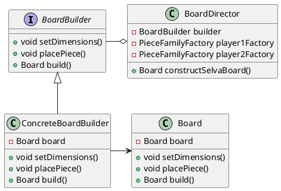
### Participantes
   - **Builder** (BoardBuilder)
      - Interface que define os métodos necessários para construir um tabuleiro.
   - **ConcreteBuilder** (ConcreteBoardBuilder)
      - Implementa a interface e cria o tabuleiro concreto, preenchendo cada casa com peças ou espaços vazios.
   - **Director** (BoardDirector)
      - Guia a construção do tabuleiro, seja para Selva, Batalha de Tanques, Camelot, ou outros jogos.
   - **Product** (Board)
      - Representa o tabuleiro em si, com métodos para configurar cada casa e exibir o tabuleiro completo.

### Código do Framework

A interface BoardBuilder define os métodos necessários para a construção de um tabuleiro de jogo. Esta interface age como um contrato, especificando as operações fundamentais que um construtor de tabuleiros deve implementar.

Ela segue o princípio da separação de responsabilidades, isolando as ações de configuração e construção do tabuleiro. Isso permite que diferentes implementações de BoardBuilder possam criar tabuleiros de formas variadas sem alterar a estrutura básica da classe Board (o produto que desejamos gerar).

@import "src/java/Tabuleiro/BoardBuilder.java"

A classe ConcreteBoardBuilder é uma implementação concreta da interface BoardBuilder. Esta classe implementa todos os métodos da interface e contém a lógica real para construir o objeto Board.

No método setDimensions, um novo objeto Board é criado com o número de linhas e colunas especificado. O método setSquare permite que o conteúdo de uma posição específica no tabuleiro seja definido. Já o método placePiece, define a posição de uma peça no tabuleiro. Finalmente, o método build retorna o tabuleiro construído, encapsulando toda a complexidade da criação do tabuleiro em uma única chamada de método.

@import "src/java/Tabuleiro/ConcreteBoardBuilder.java"

A classe Board representa o produto final que será construído pelo padrão de projeto Builder. Ela é responsável por armazenar o estado de um tabuleiro de jogo, incluindo suas dimensões e o conteúdo de cada casa. A matriz grid é usada para representar as linhas e colunas do tabuleiro, onde cada elemento da matriz pode conter uma string que representa uma peça de jogo ou um estado particular da casa (como um obstáculo, uma área vazia, etc).

@import "src/java/Tabuleiro/Board.java"

A classe BoardDirector é responsável por controlar o processo de construção do tabuleiro. Ela recebe uma instância de BoardBuilder e utiliza essa instância para construir diferentes tipos de tabuleiros conforme as regras específicas de cada jogo. O BoardDirector encapsula a complexidade da criação do tabuleiro e oferece métodos prontos para construir tabuleiros para vários jogos.

Cada método no BoardDirector segue um conjunto específico de regras para montar o tabuleiro do jogo correspondente. O uso do BoardDirector simplifica o processo de construção para o usuário final, que pode simplesmente chamar um dos métodos de construção e obter um tabuleiro completamente configurado. Ele também permite que o processo de construção seja reutilizado para diferentes tipos de tabuleiros sem necessidade de duplicação de código.

@import "src/java/Tabuleiro/BoardDirector.java"

## Factory Method

### Intenção

Definir uma interface para a criação de peças, permitindo que as subclasses decidam qual peça instanciar. Dessa maneira, a criação das peças ganha flexibilidade, uma vez que para adicionar novas peças, basta criar uma nova classe e implementar a interface "Piece.java".

### Estrutura
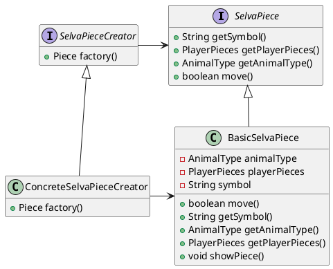
### Participantes 
   - **Creator** (SelvaPieceCreator)
      - Classe abstrata que define o método factory, deixando para a fábrica a responsabilidade de instanciá-la corretamente.
   - **ConcreteCreator** (ConcreteSelvaPieceCreator)
      - Implementação concreta da PieceFactory, especializada na criação de peças do jogo Selva.
   - **Product** (SelvaPiece)
      - Interface que define o contrato básico para todas as peças do jogo. Ela garante que todas as peças possam ser tratadas de maneira uniforme, permitindo que o código que manipula as peças seja flexível e extensível.
   - **ConcreteProduct** (BasicSelvaPiece)
      - Implementação concreta da interface Piece. Ela representa uma peça específica no jogo.
      - As demais regras e comportamentos exclusivos do animal, são implementados nesta classe, como a estratégia de movimentação.

### Código do Framework

A classe SelvaPiece é uma interface que serve como a base para todas as peças do jogo. Ela define o contrato que todas as peças devem seguir, garantindo que cada peça tenha uma representação gráfica no tabuleiro, um tipo de animal, comportamentos próprios, e uma cor, o que facilita a manipulação e a interação entre as peças dentro do jogo.

@import "src/java/Pecas/Piece.java"
@import "src/java/Selva/Pecas/SelvaPiece.java"

A classe BasicSelvaPiece é a implementação concreta da abstração, é nela que são definidos os comportamentos próprios de cada peça, bem como suas características gerais e individuais.

@import "src/java/Selva/Pecas/BasicSelvaPiece.java"

Já a classe PieceCreator é uma classe abstrata que define o método factory(). Sua função principal é fornecer uma maneira de criar objetos do tipo Piece (peças) sem que o código cliente precise conhecer as classes concretas das peças.

A PieceFactory abstrai o processo de criação das peças, permitindo que subclasses concretas decidam quais tipos de peças serão criados. Dessa maneira, novas peças podem ser adicionadas ao jogo sem a necessidade de alterar o código que solicita a criação das peças.

@import "src/java/Pecas/PieceCreator.java"
@import "src/java/Selva/Pecas/SelvaPieceCreator.java"

Por fim, a classe ConcreteSelvaPieceCreator é uma implementação concreta da SelvaPieceCreator, especializada na criação das peças para o jogo Selva. Ela implementa o método factory(), retornando uma instância de BasicSelvaPiece.

Se novas peças precisarem ser introduzidas no jogo, basta adicionar essas peças à fábrica, mantendo o restante do código desacoplado e organizado.

@import "src/java/Selva/Pecas/ConcreteSelvaPieceCreator.java"

## Abstract Factory

### Intenção

Construir famílias de peças para cada jogador sem especificar suas classes concretas.

### Estrutura
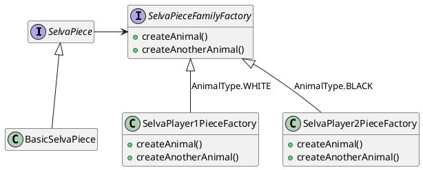
### Participantes
- **AbstractFactory** (SelvaPieceFamilyFactory)
    - Define uma interface para criar uma família de peças para cada jogador.

- **ConcreteFactory** (SelvaPlayer1PieceFactory / SelvaPlayer2PieceFactory)
    - Implementa a interface AbstractFactory e cria as instâncias concretas dos produtos. Cada ConcreteFactory é responsável por criar uma família específica de produtos. Nesse caso, um conjunto de peças para cada jogador.

- **AbstractProduct** (SelvaPiece)
    - Interface que define o contrato básico para todas as peças do jogo. Ela garante que todas as peças possam ser tratadas de maneira uniforme, permitindo que o código que manipula as peças seja flexível e extensível.

- **ConcreteProduct** (BasicSelvaPiece)
    - Classe representando a peça basica do jogo Selva, que recebe um tipo de animal (ex. Lion, Dog, Rat, etc).

### Código do Framework

A classe PieceFamilyFactory é uma interface que define um contrato para a criação de uma família de peças relacionadas no contexto de um jogo, como por exemplo, criar peças brancas ou pretas.

Para o jogo Selva, ela contém métodos como createCat() e createDog(), que devem ser implementados por fábricas concretas para retornar as versões específicas dessas peças.

O objetivo principal da PieceFamilyFactory é garantir que todas as peças criadas por uma fábrica concreta sejam consistentes entre si, pertencendo a uma família coesa de produtos.

@import "src/java/Selva/Pecas/SelvaPieceFamilyFactory.java"

As classes Player1PieceFactory e Player2PieceFactory são implementações concretas da interface PieceFamilyFactory, especializadas na criação das peças para o jogador 1 e o jogador 2, respectivamente. Cada uma dessas fábricas é responsável por produzir as versões específicas das peças que cada jogador usará no jogo.

@import "src/java/Selva/Pecas/SelvaPlayer1PieceFactory.java"
@import "src/java/Selva/Pecas/SelvaPlayer2PieceFactory.java"

Essa distinção visual e funcional entre as peças dos dois jogadores é crucial para garantir a clareza e a integridade do jogo, permitindo que cada jogador tenha um conjunto de peças único e identificável. As fábricas encapsulam toda a lógica necessária para criar as peças de seus respectivos jogadores, promovendo organização e modularidade no design do jogo. Ao separar as responsabilidades de criação das peças entre as duas fábricas, o código se torna mais flexível e fácil de manter, permitindo a introdução de novas peças ou variações sem a necessidade de alterar a lógica central do jogo.

## Singleton

### Intenção
Garantir que o tabuleiro contendo o jogo selva tenha somente uma instância e fornecer um ponto global de acesso para ele.
### Estrutura
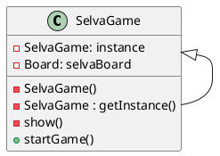
### Participantes
- **Singleton** (SelvaGame)
    - Garante que possa haver apenas uma instância de tabuleiro por jogo, através da implementação de um construtor privado, permitindo que apenas uma operação getInstance possa ser utilizada para a construção de um tabuleiro.
### Código do Framework

@import "src/java/Selva/SelvaGame.java"

# Padrões de Projeto Estruturais

## Facade

### Intenção
Simplificar o uso do sistema de construção do jogo, oferecendo uma interface mais acessível ao framework.

### Estrutura
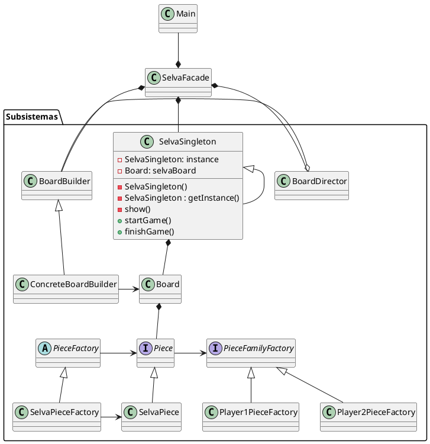

### Participantes
  - **Facade** (SelvaFacade)
      - Conhece as classes de subsistema responsáveis por cada ação no jogo Selva.
      - Delega as requisições do cliente aos objetos apropriados nos subsistemas.
   - **Classes de Subsistema** (...)
      - Implementam as funcionalidades do subsistema
      - Realizam trabalhos solicitados pelo objeto Facade
      - Não conhecem o Facade, ou seja, não possuem referências para ele
        
### Codigo do Framework
A classe SelvaFacade atua como uma camada de abstração no sistema de jogos, simplificando a interação com a lógica interna de criação e gerenciamento do jogo Selva. Ela fornece uma interface simples para operações complexas relacionadas à inicialização do tabuleiro, seleção de peças e movimentação dentro do jogo. A SelvaFacade esconde os detalhes de implementação do construtor de tabuleiro, da criação de peças e da validação de movimentos, tornando o código cliente mais acessível e limpo.

@import "src/java/Selva/SelvaFacade.java"

Através de métodos como startSelvaGame(), selectPiece() e makeMove(), a SelvaFacade encapsula e coordena a interação entre as diferentes partes do sistema, como o BoardDirector, os padrões de criação de peças (Factory/Abastract Factory), e a lógica de movimentação no tabuleiro. Isso permite que o desenvolvedor trabalhe de maneira mais intuitiva com o jogo, sem precisar se preocupar com a complexidade da construção do tabuleiro e a lógica de controle de peças.

## Bridge

### Intenção
Reduzir o número de classes geradas pelo factory method, separando a abstração da implementação concreta, de modo que as peças possam se adaptar a diferentes requisitos e cenários sem afetar as outras.

### Estrutura
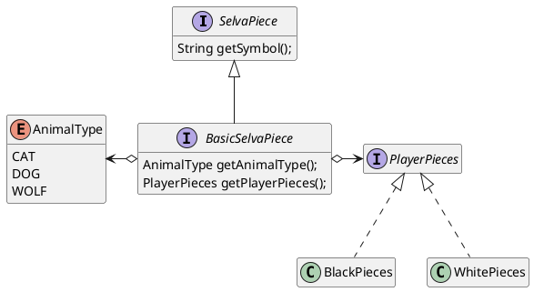

### Participantes

- **Abstraction** (SelvaPiece)
    - define a interface abstrata para as implementações das peças do jogo Selva
    - mantém uma referência a um objeto do tipo PlayerPiece, que representa o time do jogador
    - mantém uma referência a um objeto do tipo AnimalType

- **RefinedAbstraction** (BlackSelvaPiece, WhiteSelvaPiece)
    - define as características de cada peça que representa um animal

- **Implementor** (PlayerPieces)
    - define a interface para a implementação da cor de cada peça

- **ConcreteImplementor** (BlackPieces, WhitePieces)
    - fornece uma implementação concreta da interface PlayerPieces

### Codigo
A interface SelvaPiece representa a base para todas as peças do jogo Selva, permitindo que sejam associadas a um jogador e um tipo de peça. Ela contém a lógica do padrão Bridge, conectando as peças (como uma peça CAT) com os jogadores, o que permite maior flexibilidade na definição de comportamentos e tipos de peças sem criar muitas subclasses.

@import "src/java/Selva/Pecas/SelvaPiece.java"

Para reduzir o número exacerbado de classes de peças para cada animal (CatPiece, DogPiece, WolfPiece, etc), o código foi refatorado para utilizar um enum que define os diferentes tipos de animais do jogo Selva. Ele inclui valores como LION, TIGER, ELEPHANT, entre outros. Cada instância de AnimalType representa um tipo de animal específico, encapsulando seus comportamentos e características.

@import "src/java/Selva/Pecas/AnimalType.java"

A interface PlayerPieces define as características de uma peça associada a um jogador. Ela contém a lógica que diferencia os jogadores (por exemplo, peças brancas ou pretas), criando um nível de abstração para a manipulação das peças no jogo.

@import "src/java/Pecas/PlayerPieces.java"

As classes BlackPieces e WhitePieces implementam a interface PlayerPieces. Elas encapsulam a lógica que define o comportamento das peças do time preto, sendo um exemplo concreto da distinção de comportamento entre os jogadores no contexto do padrão Bridge.

@import "src/java/Pecas/BlackPieces.java"

Ao realizar essa refatoração, além de reduzir o número de classes, o código fica mais flexível para extensões e novas implementações.

## Decorator

### Intenção
Acoplar novas características para objetos ao colocá-los dentro de invólucros de objetos que contém as características.
### Estrutura
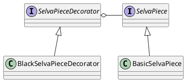
### Participantes
  - *Component* (SelvaPiece)
      - Define a interface comum para as peças.
   - *Concrete Component* (BasicSelvaPiece)
      - É a implementação concreta da interface SelvaPiece. Representa as características comuns a todas as peças, e as responsabilidades adicionais serão atribuídas de forma dinâmica.
   - *Decorator* (SelvaPieceDecorator)
      - Mantém uma referência a um objeto SelvaPiece e implementa a mesma interface. Sua função principal é delegar operações para o componente e permitir que novas características sejam adicionadas.
   - *Concrete Decorator* (BlackSelvaPieceDecorator)
      - Decora o símbolo dos objetos SelvaPiece, estendendo o comportamento do componente concreto original.
        
### Codigo do Framework

A interface SelvaPieceDecorator é uma extensão da interface SelvaPiece, criada para suportar o padrão de projeto Decorator. Ela permite que peças possam ser "decoradas" com funcionalidades adicionais, sem modificar a estrutura interna da peça original. A principal função dessa interface é garantir que qualquer decorator implementado mantenha as capacidades básicas da peça original, ao mesmo tempo em que adiciona novos comportamentos de forma flexível e modular.

@import "src/java/Selva/Pecas/SelvaPieceDecorator.java"

A classe BlackSelvaPieceDecorator é um exemplo de implementação concreta do padrão Decorator, utilizando a interface SelvaPieceDecorator. Ela decora o símbolo das peças, que são criadas originalmente brancas. O BlackSelvaPieceDecorator envolve uma instância de SelvaPiece, na qual ela altera o símbolo da própria peça para uma letra maiúscula, sem alterar o símbolo inicial básico da peça original, apenas adicionando uma nova representação visual.

@import "src/java/Selva/Pecas/BlackSelvaPieceDecorator.java"

## Flyweight

### Intenção
Otimizar a criação e o gerenciamento das peças. Com essa abordagem, você economiza memória ao reutilizar instâncias de PlayerPieces para peças que compartilham o mesmo estado (neste caso, a cor). Ao invés de criar múltiplas instâncias de peças que são essencialmente iguais em termos de cor, você mantém uma única instância e a compartilha entre todas as peças do mesmo time.
### Estrutura
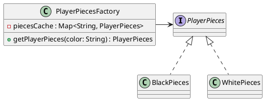
### Participantes
  - *Flyweight:* (PlayerPieces)
      - Define a interface que todas as peças (flyweights) devem implementar.
   - *Concrete Flyweight* (BlackPieces, WhitePieces)
      - Implementa a interface Flyweight e compartilha os dados internos. São as cores que serão reutilizados e compartilhados entre vários contextos.
   - *Flyweight Factory* (PlayerPiecesFactory)
      - É responsável por criar e gerenciar os objetos branco e preto. A fábrica garante que as cores dos jogadores sejam compartilhadas adequadamente, retornando uma instância existente sempre que possível.
### Codigo do Framework
No contexto do padrão Flyweight, a interface PlayerPieces atua como a classe Flyweight, representando os atributos compartilhados entre as peças que podem ser reutilizados. Nesse caso, a cor do jogador (preta ou branca) é o principal estado compartilhado, o que torna essa interface a base comum para todas as instâncias que possuem características idênticas e que podem ser reutilizadas sem necessidade de criar novas instâncias.

@import "src/java/Pecas/PlayerPieces.java"

As classes BlackPieces e WhitePieces são os Concrete Flyweights, que implementam a interface PlayerPieces. Elas armazenam o estado intrínseco das peças, ou seja, a cor "black" ou "white", que pode ser compartilhada entre todas as peças de cada jogador. Essas classes não possuem atributos que variam de peça para peça, mas, em vez disso, armazenam apenas o estado fixo (a cor), que será reutilizado em diversas instâncias de peças.

@import "src/java/Pecas/WhitePieces.java"

A PlayerPiecesFactory é a Flyweight Factory, responsável por gerenciar as instâncias de PlayerPieces. Ela garante que, para cada cor (preto ou branco), apenas uma instância de BlackPieces ou WhitePieces será criada e compartilhada entre as peças. Ao solicitar uma peça com determinada cor, a fábrica verifica se já existe uma instância dessa cor em seu cache; se não, ela cria uma nova instância e a armazena para reutilização futura. Essa abordagem economiza recursos ao evitar a criação de múltiplas instâncias idênticas.

@import "src/java/Pecas/PlayerPiecesFactory.java"

Assim, a PlayerPiecesFactory trabalha em conjunto com as classes BlackPieces e WhitePieces para implementar o padrão Flyweight, garantindo que o estado compartilhado seja gerenciado de forma eficiente, enquanto o estado variável de cada peça (como tipo de animal e simbolo) seja tratado separadamente.

# Padrões de Projeto Comportamentais

## State

### Intencao

Permite a um objeto alterar seu comportamento quando o seu estado interno muda. No contexto desse framework, o comportamento da movimentação de peças será alterado para só permitir que a peça do jogador atual seja movida.

### Estrutura
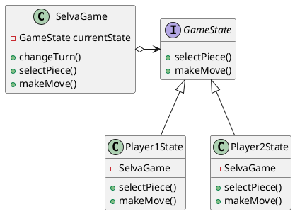
### Participantes

- **Context** (SelvaGame)
    - Garante que possa haver apenas uma instância de tabuleiro por jogo.
    - Define o que acontece no jogo.
    - Armazena uma referência para o estado atual.

- **State** (GameState)
    - Define uma interface para encapsulamento comum para todos os estados.

- **ConcreteState** (Player1State, Player2State)
    - Implementa o comportamento específico para cada um dos jogadores, garantindo que cada jogador consiga mover apenas as suas peças.

### Codigo do Framework

A interface GameState define os comportamentos esperados para os estados do jogo. Além disso, a interface fornece uma forma de desacoplamento entre a lógica de jogo e o estado do jogador. Isso significa que, ao alterar a lógica de um estado, como Player1State ou Player2State, a interface pode garantir que qualquer implementação futura seguirá as mesmas regras.

@import "src/java/Game/GameState.java"

A classe Player1State implementa a interface GameState e contém a lógica específica para o jogador 1, que, neste caso, manipula as peças brancas. O método selectPiece permite que o jogador selecione uma peça no tabuleiro. Se a peça for válida e pertencer ao jogador 1, ela será marcada como selecionada. Caso contrário, o jogador receberá uma mensagem informando que apenas pode selecionar suas peças. Essa verificação é essencial para manter as regras do jogo e garantir que cada jogador apenas interaja com suas próprias peças.

No método makeMove, a classe verifica se uma peça foi previamente selecionada e se essa peça pertence ao jogador 1. Se as condições forem atendidas, a peça pode ser movida na direção especificada, utilizando a lógica de movimento do tabuleiro. Após um movimento bem-sucedido, o estado do jogo é atualizado e o turno é trocado, permitindo que o jogador 2 jogue em seguida. Essa estrutura não apenas simplifica a lógica de movimentação, mas também garante que o jogo siga as regras definidas, oferecendo uma experiência de jogo coesa.

@import "src/java/Game/Player1State.java"

@import "src/java/Game/Player2State.java"

A classe Player2State, assim como a Player1State, implementa a interface GameState, mas se concentra na lógica para o jogador 2, que controla as peças pretas. A mudança de estado entre Player1State e Player2State é gerenciada pelo objeto Game, que mantém a referência ao estado atual. Quando o turno de um jogador termina, o jogo muda o estado atual para o jogador adversário

## Strategy

### Intencao

Permitir de maneira simples a variação dos algoritmos utilizados na resolução de um determinado problema. No contexto desse framework, o Strategy está sendo utilizado para alterar o comportamento move() do elefante e do rato, que possuem características de movimento e captura especiais.

### Estrutura

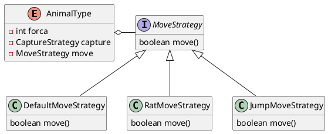

### Participantes

- **Context** (AnimalType)
    - é configurado com os objetos ConcreteStrategy;
    - mantém uma referência para um objeto Strategy, sendo esta passada pelo construtor ao instanciar o tipo do animal;

- **Strategy** (MoveStrategy)
    - define uma interface comum para todos os algoritmos suportados. AnimalType usa esta interface para definir o movimento de cada animal.

- **ConcreteStrategy** (DefaultMoveStrategy, RatMoveStrategy, , JumpMoveStrategy)
    - implementa o algoritmo usando a interface de Strategy.

### Codigo do Framework

A interface MoveStrategy define o contrato para as estratégias de movimento no jogo Selva. Ela estabelece o método move, que deve ser implementado por classes concretas para definir como diferentes tipos de peças se movem no tabuleiro.

@import "src/java/Pecas/MoveStrategy.java"

A classe DefaultMoveStrategy implementa a interface MoveStrategy e fornece uma lógica de movimento padrão para as peças no tabuleiro. Ela verifica se a nova posição é válida, se a casa destino é acessível e se a peça pode capturar uma peça adversária. Essa classe serve como base para as peças que não possuem comportamentos de movimento especiais, simplificando a lógica do jogo e garantindo que as regras básicas de movimentação sejam seguidas.

@import "src/java/Selva/Pecas/DefaultMoveStrategy.java"

Já a classe RatMoveStrategy estende a lógica de movimento para o rato, implementando a interface MoveStrategy. Ela incorpora regras específicas, permitindo que o rato entre na água e, ao sair, altere sua condição de movimento. Além disso, essa classe define que um rato na água não pode capturar um elefante ao saltar para fora, garantindo que ele tenha que realizar uma jogada adicional antes de interagir com peças mais fortes. Isso reflete a estratégia única do rato no jogo.

@import "src/java/Selva/Pecas/RatMoveStrategy.java"

A classe JumpMoveStrategy altera o movimento do leão e do tigre. Ela adiciona a habilidade especial de salto para peças como o leão e o tigre, permitindo que essas peças saltem sobre casas com água, desde que não haja um rato nelas.

@import "src/java/Selva/Pecas/JumpMoveStrategy.java"

Essas classes são instanciadas quando o movimento de mover é chamado, a depender do animal que está realizando o movimento. Essa estrutura modular facilita a manutenção e a extensão do jogo, pois novos comportamentos podem ser facilmente adicionados ou modificados sem alterar as classes existentes, assegurando uma experiência de jogo dinâmica e variada.

## Command

### Intencao

Controlar as chamadas a um determinado componente, no contexto desse framework, a movimentação (método makeMove), modelando cada requisição como um objeto. Permitir que as operações possam ser desfeitas, enfileiradas ou registradas.

### Estrutura
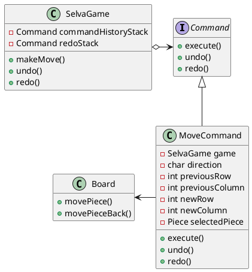
### Participantes

- **Command** (Command)
    - Define a interface comum para todos os comandos, com os métodos execute, undo e redo.
- **ConcreteCommand** (MoveCommand)
    - Implementa os comandos execute, undo e redo, referenciando o Board. O método execute() chama a ação move no tabuleiro.
- **Receiver** (Board)
    - Realiza as operações reais que o comando abstrai.
- **Invoker** (SelvaGame)
    - Armazena e executa os comandos. Ele chama o execute() no comando e mantém uma lista para desfazer as ações.

### Codigo do Framework

No código do jogo Selva, o Command foi implementado para gerenciar os movimentos das peças no tabuleiro de forma que possam ser facilmente desfeitos e refeitos.

@import "src/java/Game/Command.java"

A classe MoveCommand representa o comando específico para movimentar uma peça, interagindo com a classe Board, que atua como o receiver. A lógica de movimentação real da peça é realizada pelo tabuleiro, mas abstraída pelo comando, permitindo que o jogo seja mais flexível e que o histórico de movimentos seja controlado.

@import "src/java/Game/Command.java"

O SelvaGame atua como o invoker, utilizando o CommandManager para gerenciar a execução e desfazer ações conforme necessário, proporcionando um controle eficiente do fluxo do jogo e das interações dos jogadores.

@import "src/java/Game/CommandManager.java"

Com essa arquitetura, o jogo consegue facilmente reverter um movimento incorreto ou aplicar o conceito de redo para refazer uma jogada desfeita, o que melhora a experiência de usabilidade e a organização do código.

## Memento

### Intencao
Sem violar o encapsulamento, salvar e carregar um estado interno de um objeto, de maneira que o objeto possa ser restaurado para esse estado mais tarde.
### Estrutura
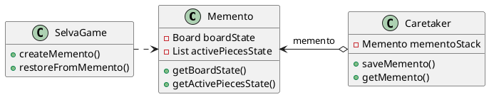

### Participantes

- **Originator** (SelvaGame)
    - A classe que cria o memento e restaura o seu estado a partir dele.
- **Memento** (Memento)
    - A classe que armazena o estado do objeto originador. Ela contém os dados necessários para restaurar o estado do jogo.
- **Caretaker** (Caretaker)
    - A classe que gerencia os mementos e mantém o histórico dos estados.

### Codigo do Framework

O padrão de projeto Memento é utilizado para salvar e carregar os saves do jogo. No nosso framework, a classe Memento armazena o estado do tabuleiro e as peças ativas em um momento específico. Esta classe contém duas informações principais: o estado atual do tabuleiro, representado por uma matriz bidimensional, e uma lista de objetos do tipo Piece, que representam as peças ativas do jogo. 

@import "src/java/Game/Memento.java"

Ao usar o Memento, o jogo pode reverter para um estado anterior, oferecendo ao jogador a possibilidade de desfazer movimentos ou recuperar estados anteriores em caso de erro.

Por outro lado, a classe Caretaker atua como um guardião dos objetos Memento. Sua função principal é gerenciar a coleção de mementos, permitindo que o jogo salve e carregue seu estado de maneira eficiente. No contexto desse framework, o Caretaker armazena múltiplos estados do jogo em uma pilha, permitindo que o jogador restaure o jogo ao último estado salvo ou a um estado anterior, se necessário.

@import "src/java/Game/Caretaker.java"

A interação entre o SelvaGame, Memento e Caretaker é essencial para a experiência do jogador. Quando um jogador precisar salvar o jogo, ele pode chamar o método saveGame, que cria um novo Memento contendo o estado atual do jogo e o armazena no Caretaker.

Se o jogador deseja reverter sua última jogada, ele pode usar o método loadGame, que recupera o último Memento armazenado e restaura o estado do jogo. Assim, o SelvaGame consegue manter a continuidade da partida, permitindo que os jogadores experimentem diferentes estratégias e jogadas sem o medo de perder o progresso realizado.

# Construindo um Novo Jogo

## Passo a Passo para utilização do Framework

### Passo 1 - Criando a Interface:

- O primeiro passo para criar um novo jogo, é garantir que ele possua uma interface central, onde o jogo deve acontecer. Para isso, implemente a interface Game, que definirá o seu Singleton. Caso você utilize o Java Extension Pack do VS Code, clique no nome da classe e pressione ctrl + . no teclado, para adicionar todos os métodos da interface.

@import "img/Screenshot_1.png"

- Sua classe Game deve ficar parecida com o código abaixo. Não se preocupe se não tiver as lógicas definidas no ínicio da construção, iremos definí-las conforme a construção do jogo.

@import "src/java/Tanques/TanksBattleGame.java"

### Passo 2 - Criando o Tabuleiro:

- O tabuleiro é gerado através do *builder*. Para definir as dimensões do tabuleiro, você deve construí-lo ao instanciar seu jogo. Para isso, instancie um objeto ConcreteBoardBuilder e construa o tabuleiro. Para construir o tabuleiro, chame o seu builder utilizando esses métodos:

```java
builder.setDimensions(int rows, int columns) // esse metodo definirá as dimensões do seu tabuleiro. Ele define uma matriz contendo as linhas e colunas de sua preferência.
builder.placePiece(int row, int column, Piece piece) // através desse método, você poderá colocar suas peças na posição inicial, ou onde você bem entender!
builder.setSquare(int row, int column, String content) // esse método define o conteúdo da célula. Caso você não defina o conteúdo, por padrão, a célula conterá um espaço vazio " ".
builder.build() // após construir o seu tabuleiro, utilize esse método para 
```

- Caso prefira poupar código na sua classe principal, você pode optar por utilizar um *Director*, criando uma classe com herança de *BoardDirector*.

@import "src/java/Tanques/Tabuleiro/TanksBattleBoardDirector.java"

### Passo 3 - Criando as Peças:

- Para criar as peças é bem simples, basta criar uma classe que implemente a interface Piece. Os métodos e características adicionais podem ser definidos nela. No exemplo do batalha de tanques, um tanque pode ser normal ou comandante, então defini um ENUM tankType para identificá-los.

@import "src/java/Tanques/Pecas/TankType.java"

@import "src/java/Tanques/Pecas/TankPiece.java"

### Passo 4 - Criando as Famílias de Peças:

- Agora que você já tem a classe da sua peça básica criada, vamos criar as famílias para cada jogador. Para isso, utilize o padrão Abstract Factory, conforme os passos a seguir:

- Crie uma interface PieceFamilyFactory, conforme demosntrado no código abaixo, as suas famílias devem implementá-la.

@import "src/java/Tanques/Pecas/TanksPieceFamilyFactory.java"

- Agora que você já tem sua base definida, resta apenas implementar a criação das peças em cada família.

@import "src/java/Tanques/Pecas/TanksPlayer1PieceFactory.java"
@import "src/java/Tanques/Pecas/TanksPlayer2PieceFactory.java"

- **DICA!!** : Caso em seu jogo haja muitas repetições de peças, utilizar um flyweight para armazenar uma unica instância de características comuns das peças pode otimizar a perfomance do seu jogo e preservar a memória.

- Para criar um flyweight das suas peças, basta implementar o código do seu flyweight seguindo o padrão abaixo, lembrando que o framework já disponibiliza um flyweight para a cor das peças.

@import "src/java/Tanques/Pecas/TankPieceFlyweightFactory.java"

- Caso você opte por não utilizar um flyweight e criar a decoração de cada peça através de um novo objeto, basta apenas implementar a interface Piece e extender a classe implementada, decorando as suas peças pretas na criação das mesmas.

- Por padrão, o framework contém as classes PieceDecorator e BlackPieceDecorator, não sendo necessária a criação de novas classes a menos que a peça do seu jogo tenha algum atributo ou método adicional.

- A classe que implementa o Piece é responsável por garantir que os métodos da sua peça permaneçam intactos. Portanto, os retornos devem ser os próprios métodos da referência da sua peça.

@import "img/Screenshot_3.png"

- Crie uma classe que estenda a classe criada anteriormente, caso necessário.

@import "img/Screenshot_4.png"

- A criação da sua segunda família de peças seria muito semelhante a primeira, exceto que as peças precisariam ser decoradas para terem seu visual atualizado.

```java
//primeira família de peças:
public SelvaPiece createCat() {
    return new BasicSelvaPiece(AnimalType.CAT.getSymbol(), PlayerPiecesFactory.getPlayerPieces("white"), AnimalType.CAT);
}

//segunda família de peças:
public SelvaPiece createCat() {
        return new BlackSelvaPieceDecorator(new BasicSelvaPiece());
    }
```

### Passo 5 - Criando a Fachada do Jogo

- Com o seu tabuleiro criado e as suas peças definidas, iremos criar uma camada de abstração no sistema de jogos, simplificando a interação com a lógica interna de criação e gerenciamento do jogo. A Fachada irá esconder os detalhes de implementação do construtor de tabuleiro, da criação de peças e da validação de movimentos, tornando o código cliente mais acessível e limpo.

- A fachada é opcional, porém tornará o seu software muito mais limpo e intuitivo para os jogadores. Aqui está um exemplo de fachada para o jogo de Batalha de Tanques:

@import "src/java/Tanques/TanksBattleFacade.java"

- Após a execução desses passos, o tabuleiro inicial está montado e já é possível visualizar o seu jogo!

@import "img/Screenshot_2.png"


### Passo 6 - Definir o Comportamento das Peças

- Para definir o comportamento de movimentação das peças, primeiramente definimos o comportamento básico delas. Para isso, podemos criar uma classe DefaultTankMoveStrategy que implementa a interface MoveStrategy. Nela defina a lógica de movimentação básica e comum a todas as peças.

@import "src/java/Tanques/Pecas/DefaultTankMoveStrategy.java"

- Então crie a lógica para os outros comportamentos que diferem do básico, implementando a interface MoveStrategy, para que não de conflito no restante do codigo.

@import "src/java/Tanques/Pecas/CommandTankMoveStrategy.java"

### Passo 7 - Definir a Logica de finalização

- Por fim, basta escrever a logica de finalização do jogo. Nesse caso, a lógica foi escrita no próprio Singleton, mas pode ser escrita conforme o entendimento do usuário da necessidade de seu negócio.

## Referências
1. SHVETS, Alexander. Refactoring Guru: Refatoração e Padrões de Projeto. 2010-2024. Disponível em: https://refactoring.guru/pt-br/design-patterns/facade. Acesso em: set. 2024.
2. CARGILL, T. C++ Programming Style. USA: Addison-Wesley Publishing Company, 1992.
3. GAMMA, Erich. et al. Padrões de projetos: Soluções reutilizáveis de software orientados a objetos Bookman editora, 2009.
4. SOUZA, Leandro. PPR | 20241 PPR Blog das Aulas. 2024. Disponível em: https://20241-ifba-saj-ads-ppr.github.io/blog-material-aula/. Acesso em: set. 2024.